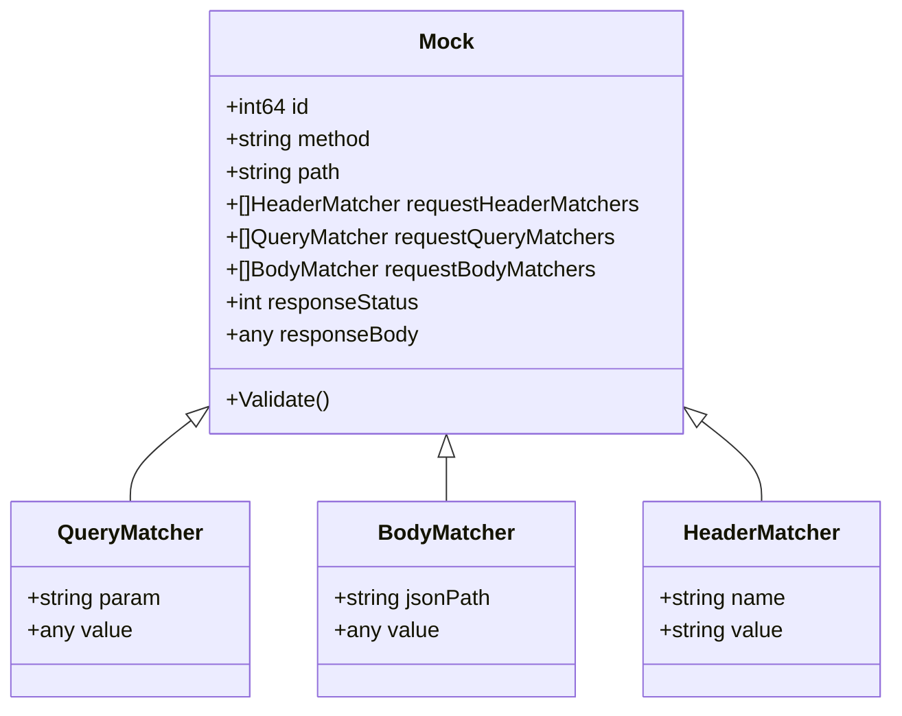

# Mockery

Simple and lightweight mock server.

Features:

- [x] Path matching
- [x] Query matching
- [x] Header matching
- [x] Body matching
- [ ] Regex matching (?)

Persistence:

- [x] SqLite
- [ ] PostgreSql

## [ToC]

- [Schema](#schema)
  - [Class diagram](#class-diagram)
  - [Validations](#validations)
- [Config](#config)
  - [Endpoints](#endpoints)
- [Examples](#examples)
  - [Path Matching](#simple-path)
  - [RequestBody Matching](#requestbody-matching)
  - [RequestQuery Matching](#requestquery-matching)
  - [RequestHeader Matching](#requestheader-matching)

## Schema

### Class diagram



### Validations

- Mock.method
  - Not empty
  - Valid http method
- Mock.path
  - Not empty
- Mock.responseStatus
  - Not empty
  - Valid http status

## Config

### Endpoints

- POST /config
  - ResponseStatus: 201
  - RequestBody:

    ```json
    {
      "method": "GET",
      "path": "/foo/bar",
      "responseStatus": 418,
      "responseBody": { "foo": "bar", "baz": 1 }
    }
    ```

- GET /config?method=GET&path=/foo/bar
  - ResponseStatus: 200
  - ResponseBody:

    ```json
    {
      "method": "GET",
      "path": "/foo/bar",
      "responseStatus": 418,
      "responseBody": { "foo": "bar", "baz": 1 }
    }
    ```

- GET /config/list
  - ResponseBody:

    ```json
    [
      {
        "id": 1,
        "method": "GET",
        "path": "/asd/asd",
        "responseStatus": 200,
        "responseBody": { "asd": "zxc", "qwe": 1 }
      },
      {
        "id": 2,
        "method": "GET",
        "path": "/asd/asd",
        "responseStatus": 200,
        "responseBody": { "asd": "zxc", "qwe": 1 }
      },
      {
        "id": 3,
        "method": "GET",
        "path": "/asd/qwe",
        "responseStatus": 418,
        "responseBody": { "asd": "zxc", "qwe": 1 }
      },
      {
        "id": 4,
        "method": "POST",
        "path": "/zxc",
        "responseStatus": 201,
        "responseBody": { "asd": "zxc", "qwe": 1 }
      }
    ]
    ```

- DELETE /config?id=1
  - ResponseStatus: 200

## Examples

### Simple path

- POST /config
  - ResponseStatus: 201
  - RequestBody:

    ```json
    {
      "method": "GET",
      "path": "/foo/bar",
      "responseStatus": 418,
      "responseBody": { "foo": "bar", "baz": 1 }
    }
    ```

- GET /foo/bar
  - ResponseStatus: 418
  - ResponseBody:

    ```json
    {
      "foo": "bar",
      "baz": 1
    }
    ```

### RequestBody Matching

- POST /config
  - ResponseStatus: 201
  - RequestBody:

    ```json
    {
      "method": "POST",
      "path": "/person",
      "requestBodyMatchers": [{ "jsonPath": "$.firstName", "value": "John" }],
      "responseStatus": 418,
      "responseBody": {
        "firstName": "John",
        "lastName": "doe",
        "age": 26,
        "address": {
          "streetAddress": "naist street",
          "city": "Nara",
          "postalCode": "630-0192"
        },
        "phoneNumbers": [
          { "type": "iPhone", "number": "0123-4567-8888" },
          { "type": "home", "number": "0123-4567-8910" }
        ]
      }
    }
    ```

- POST /person
  - RequestBody:

    ```json
    {
      "firstName": "John"
    }
    ```

  - ResponseStatus: 418
  - ResponseBody:
    ```json
    {
      "firstName": "John",
      "lastName": "doe",
      "age": 26,
      "address": {
        "city": "Nara",
        "postalCode": "630-0192",
        "streetAddress": "naist street"
      },
      "phoneNumbers": [
        { "number": "0123-4567-8888", "type": "iPhone" },
        { "number": "0123-4567-8910", "type": "home" }
      ]
    }
    ```

### RequestQuery Matching

- POST /config
  - ResponseStatus: 201
  - RequestBody:

    ```json
    {
      "method": "GET",
      "path": "/person",
      "requestQueryMatchers": [{ "param": "id", "value": 1 }],
      "responseStatus": 418,
      "responseBody": {
        "firstName": "John",
        "lastName": "doe",
        "age": 26,
        "address": {
          "streetAddress": "naist street",
          "city": "Nara",
          "postalCode": "630-0192"
        },
        "phoneNumbers": [
          { "type": "iPhone", "number": "0123-4567-8888" },
          { "type": "home", "number": "0123-4567-8910" }
        ]
      }
    }
    ```

- GET /person?id=1
  - ResponseStatus: 418
  - ResponseBody:
    ```json
    {
      "firstName": "John",
      "lastName": "doe",
      "age": 26,
      "address": {
        "city": "Nara",
        "postalCode": "630-0192",
        "streetAddress": "naist street"
      },
      "phoneNumbers": [
        { "number": "0123-4567-8888", "type": "iPhone" },
        { "number": "0123-4567-8910", "type": "home" }
      ]
    }
    ```

### RequestHeader Matching

- POST /config
  - ResponseStatus: 201
  - RequestBody:

    ```json
    {
      "method": "GET",
      "path": "/fooHeader",
      "requestHeaderMatchers": [
        { "name": "foo", "value": "false" }
      ],
      "responseStatus": 418,
      "responseBody": {
        "foo": false,
        "bar": [
          {"baz": 3},
          {"baz": 4}
        ]
      }
    }
    ```

- GET /fooHeader
  - RequestHeaders
    - foo: false
  - ResponseStatus: 418
  - ResponseBody:
    ```json
    {
      "foo": false,
      "bar": [
        {"baz": 3},
        {"baz": 4}
      ]
    }
    ```
